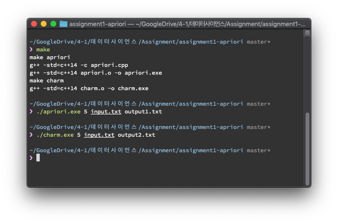
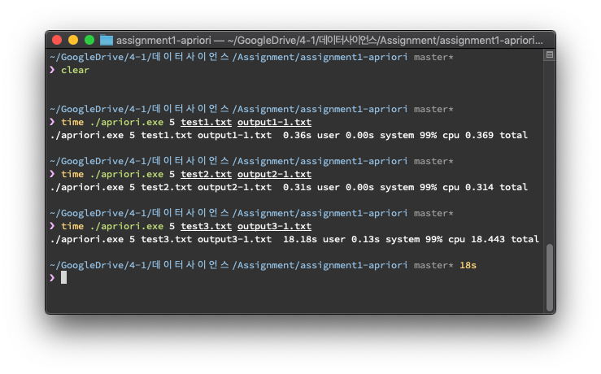
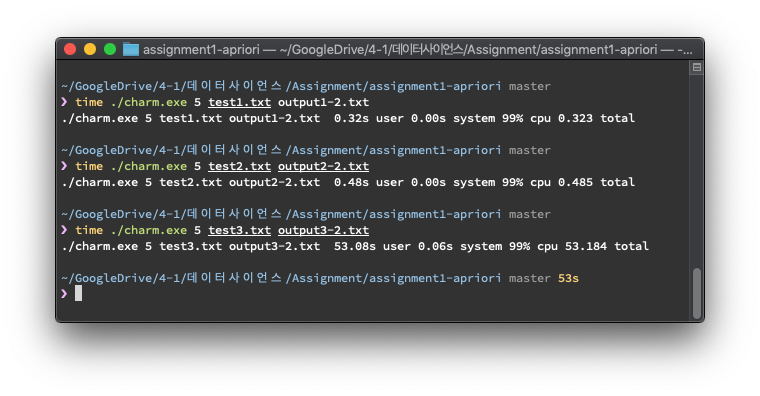
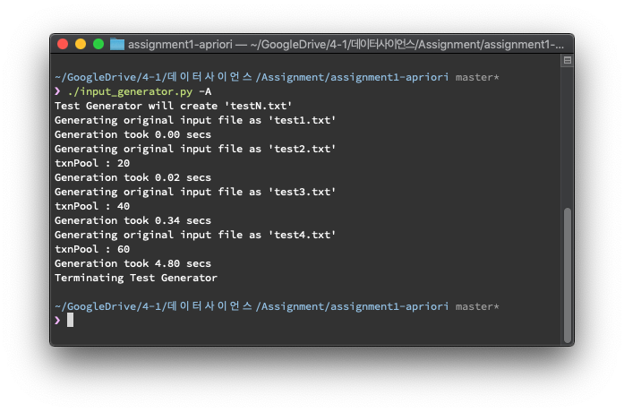
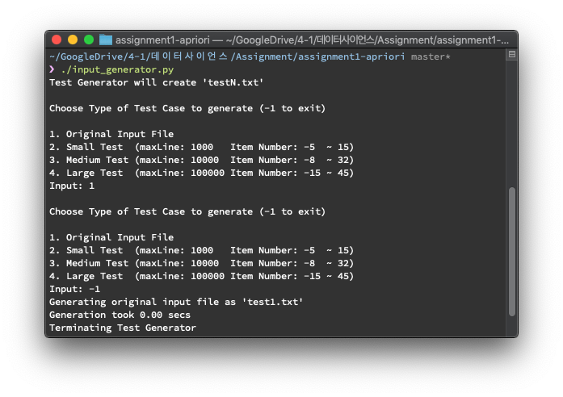
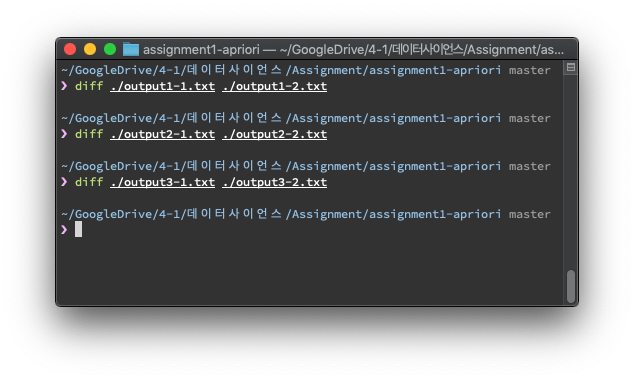

# Finding Association Rules

[](https://github.com/lazyren)

Generate 'Frequent Patterns'(FP) using apriori or charm algorithm.<br>Generated FP then used to find association rules with `support >= min_support`.<br>


## Quick Start

All programs are tested on macOS 10.14 & Ubuntu 18.04<br>

### Requirements

Below lists must be pre-installed before executing or compiling.

* C++14
* Python3

### Compiling

|   Command    | Description                             |
| ---------- | -------------------------------------- |
|     make     | compile both apriori & charm            |
| make apriori | create apriori.exe file                 |
|  make charm  | create charm.exe file                   |
|  make clean  | remove all compiled source (*.o, *.exe) |



### How to Run

#### Apriori.exe & Charm.exe

Below commands will execute program to analyze input file and save association rules and related information to the output file.

charm.exe simulates charm algorithm, produced because of my misunderstanding of assignment. It does produce the same output, but you can safely ignore it.

```bash
./apriori.exe [min_support] [input file] [output file]
./charm.exe [min_support] [input file] [output file]
```





**Note** that program will terminate immediately if

* all 3 argvs are not provided
* program failed to parse min_support
* setting min_support to **0**
* program failed to open input file
* program failed to create output file

However, any extra argvs will be ignored and does not affect program's execution.<br>


#### input_generator.py

This python3 script will generate test files including given example.<br>Either of below commands will execute script. But file needs execute permission in order to use first one.<br>If first command failes due to permission issue, try second command, or give file a execute permission.

```bash
./input_generator.py (optional argv)
python3 input_generator.py (optional argv)
```

If `-all` or `-A` is given as argv, script will automatically generate all 4 test files.<br>Else, you can choose which test file to generate.

| Test File Name | # of Transactions | # of Max Item per Txn | Approx. file size |
| -------------- | ----------------- | --------------------- | ----------------- |
| test1.txt      | 500               | 10                    | 7 KB              |
| test2.txt      | 1000              | 10                    | 14 KB             |
| test3.txt      | 10000             | 20                    | 290 KB            |
| test4.txt      | 100000            | 30                    | 4.6 MB            |





## Implementation

#### Terminology

*n-FP* : Frequent Pattern with length of *n*<br>candidate: itemset(or pattern) that might be a FP.<br>

### Apriori

Among below functions, I will not cover language-specific functions such as `parseArgv()` , `setToString()` etc. They are well explained within code with fluent amount of comments.<br>

```c++
void parseArgv(int argc, char *argv[]);
void parseTransaction();
void apriori();
void generateCandidate(set<set<int> >& candidate, int poolSize);
void pruning(set<set<int> >& candidate, int poolSize);
void printToOutputFile();
bool isFrequent(const set<int>& curItemset);
template<class Set1, class Set2>
bool isDisjoint(const Set1 &set1, const Set2 &set2);
int calcSupport(const set<int>& fp1, const set<int>& fp2);
string setToString(const set<int>& tempSet);
void printItemset();
```

#### Containers

```c++
vector<set<int> > transaction;
vector<set<set<int> > > itemset;
map<set<int>, int> itemsetFrequency;
```

Each item in transaction vector represents one row(txn) from input file. Since transaction does not contain duplication, set is used to represent the row.<br>itemset is bit more complex than transaction.<br>itemset[1] = set of FPs with length 1, itemset[2] = set of FPs with length 2 ...

In itemset[n], another set is nested within set. Each **inner set** represents actual **FP**. Outter set is just a container to prevent duplicate. Thanks to STL set, programmer(me) does not have to worry about inserting already existing value.<br>

`map<set<int>`, int> holds count of `set<int>`(itemset) within DB, preventing redundant DB searching.

#### Program Flow

<pre>
parseArgv() -> parseTransaction() -> apriori() -> printToOutputFile()
                                     |       ^
                                     |       |
                                     |       |
                                     v       |
                    generateCandidate() -> pruning()
</pre>

##### apriori()

```c++
set<set<int> > emptyItemset;
itemset.push_back(emptyItemset);/* 0-itemset */
itemset.push_back(emptyItemset);/* 1-itemset */

/*
 * put all items of length 1.
 * Don't mind of duplication.
 * STL set does not allow dupicate item inserted.
 */
for (auto& txn : transaction) {
  for (auto& item : txn) {
    set<int> tempSet;
    tempSet.insert(item);
    itemset[1].insert(tempSet);
  }
}
/* remove all 1-itemset with support < minSupport */
for (auto itr = itemset[1].begin(); itr != itemset[1].end(); ) {
  if (isFrequent(*itr))
    itr++;
  else
    itr = itemset[1].erase(itr);
}
```

After all transactions are safely stored in `vector<set<int> > transaction`, generating FP starts by creating *0-FP*(empty set) and *1-FP*.<br>In order to generate *size-1 FP*, simply insert all items from DB and remove item with support < minSupport.<br>

##### generateCandidate()

Starting from *size-2 FP*, new candidates are created based on previous FP(FP with size-1). This is done by `generateCandidate()`. Logic is simple, so I will not cover any more details.

```c++
/*
 * generate FP candidates with size = poolSize + 1
 * All candidates are stored within set<set<int> > candidate.
 * WARNING: candidates are not FP. It is caller's responsibility to
 * prune them by calling pruning()
 */
void generateCandidate(set<set<int> >& candidate, int poolSize)
{
	const set<set<int> >& pool = itemset[poolSize];

	for (auto itr = pool.begin(); next(itr) != pool.end(); itr++) {
		for (auto nextItr = next(itr); nextItr != pool.end(); nextItr++) {
			set<int> newItemset;
			set_union(itr->begin(), itr->end(),
						nextItr->begin(), nextItr->end(),
						inserter(newItemset, newItemset.begin()));
			if (newItemset.size() != poolSize + 1)
				break;
			candidate.insert(newItemset);
		}
	}
}
```


##### pruning()

`generateCandidate()` does not guarantee outcome to be FP. It is caller's responsibility to call `pruning()` to erase any itemset that is not FP.<br>If subset of candidate is not FP, candidate is not FP for sure. So again, function checks candidate with set of *FPs with size - 1*.

```c++
/*
 * Remove any itemset that can be pruned.
 * if subset of itemset is not itemset,
 * we can safely assume that itemset is also not a FP.
 */
void pruning(set<set<int> >& candidate, int poolSize)
{
	const set<set<int> >& pool = itemset[poolSize];

	for (auto itr = candidate.begin(); itr != candidate.end(); ) {
		bool isPruned = false;
		for (int i = 0; i < itr->size(); i++) {
			set<int> tempSet(*itr);
			auto rm = tempSet.begin();
			advance(rm, i);
			tempSet.erase(rm);
			if (pool.find(tempSet) == pool.end()) {
				isPruned = true;
				break;
			}
		}
		if (isPruned)
			itr = candidate.erase(itr);
		else
			itr++;
	}
}
```


##### isFrequent()

Even after pruning is done, remaining candidates still have some posibility of not being FP. So we must check it's actual support and compare it with minSupport. This is done by `isFrequent()`. It's short-simple function that lookups the whole DB.<br>To save future DB searching, it saves frequency of itemset to `map<set<int>, int> > itemsetFrequency`<br>Time Complexity = O(rc) *r = number of transaction* *c = number of items in row*

```c++
/*
 * lookup DB to check whether provided itemset is frequent or not.
 * This function also saves itemsetFrequency if itemset is frequent.
 */
bool isFrequent(const set<int>& curItemset)
{
	int cnt = 0;
	for (auto& txn : transaction) {
		bool found = true;
		for (auto& item : curItemset) {
			auto itr = txn.find(item);
			if (itr == txn.end()) {
				found = false;
				break;
			}
		}
		if (found)
			cnt++;
	}

	if ((cnt/totalTxn)*100 >= minSupport) {
		itemsetFrequency[curItemset] = cnt;
		return true;
	}
	else
		return false;
}
```


In `apriori()`, function repeatedly calls `generateCandidate()` & `pruning()` & remove non-FP until new candidate no longer exist.<br>

```c++
int itemsetSize = 1;
while (true) {
  set<set<int> > candidate;
  generateCandidate(candidate, itemsetSize);
  pruning(candidate, itemsetSize);

  for (auto itr = candidate.begin(); itr != candidate.end(); ) {
    if (isFrequent(*itr))
      itr++;
    else
      itr = candidate.erase(itr);
  }
  if (candidate.empty())
    break;
  else
    itemset.push_back(candidate);
  itemsetSize++;
}
```

When function breaks out of infinite-loop, all FP from input file is created. Now `main()` calls `printToOutputFile()` which not only writes actual format to file, but also finds association rules to write.


##### printToOutputFIle()

First of all, for the convenience of iteration, move all created FP to itemset[0]. After that, use nested for-loop to iterate over FP to find two FP that are disjoint to each other and support >= minSupport.

```c++
/*
 * Generate Association Rules and write it to output file.
 * After this function is called,
 * accessing itemset[n] n >= 1 will not be valid since all FP(itemsets)
 * are moved to itemset[0] and erased from the original place for the memory efficiency & iteration convenience.
 */
void printToOutputFile()
{
	outFile.setf(ios_base:: fixed, ios_base:: floatfield);

	/* For the convenience of iteration, all itemsets will be inserted into itemset[0]
	 * Note that previous items will be removed from itemset[n](n >= 1) to save some memory.
	 */
	set<set<int> >& frequentPattern = itemset[0];
	for (auto curPool = itemset.begin() + 1; curPool != itemset.end(); curPool++) {
		frequentPattern.insert(curPool->begin(), curPool->end());
		curPool->clear();
	}
	for (auto itr = frequentPattern.begin(); itr != frequentPattern.end(); itr++) {
		for (auto comp = frequentPattern.begin(); comp != frequentPattern.end(); comp++) {
			if (!isDisjoint(*itr, *comp))
				continue;
			double support = static_cast<double>(calcSupport(*itr, *comp));
			if ((support/totalTxn * 100) < minSupport)
				continue;
			set<int> emptySet;
			double confidence = (static_cast<double>(support)/calcSupport(*itr, emptySet)) * 100;
			support = support/totalTxn * 100;

			outFile << setprecision(2)
							<< setToString(*itr) << "\t" << setToString(*comp)<< "\t"
							<< support << "\t" << confidence << "\n";
		}
	}
}
```

##### calcSupport()

Thanks to saving frequency in `map<set<int>, int> > itemsetFrequency`, it simply unions two argvs and search it from map. If key does not exist, it will return 0.

```c++
/*
 * return number of transactions that contain [item_set] ∪ [associative_item_set]
 */
int calcSupport(const set<int>& fp1, const set<int>& fp2)
{
	set<int> unionPattern;
	set_union(fp1.begin(), fp1.end(),
				fp2.begin(), fp2.end(),
				inserter(unionPattern, unionPattern.begin()));

	return itemsetFrequency[unionPattern];
}
```


##### isDisjoint()

It's a helper function that checks whether two sets are disjoint or not.

```c++
/*
 * Helper function to check if intersection of two sets is empty
 * https://stackoverflow.com/questions/1964150/c-test-if-2-sets-are-disjoint
 */
template<class Set1, class Set2>
bool isDisjoint(const Set1 &set1, const Set2 &set2)
{
	if (set1.empty() || set2.empty())
		return true;

	typename Set1::const_iterator
		it1 = set1.begin(),
		it1End = set1.end();
	typename Set2::const_iterator
		it2 = set2.begin(),
		it2End = set2.end();

	if (*it1 > *set2.rbegin() || *it2 > *set1.rbegin())
		return true;

	while (it1 != it1End && it2 != it2End) {
		if (*it1 == *it2) return false;
		if (*it1 < *it2) { it1++; }
		else { it2++; }
	}

	return true;
}
```


## Test Results




As you can see, output of apriori & charm has no diffrence at all.