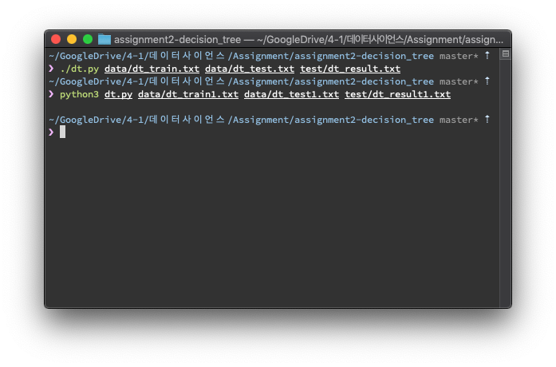
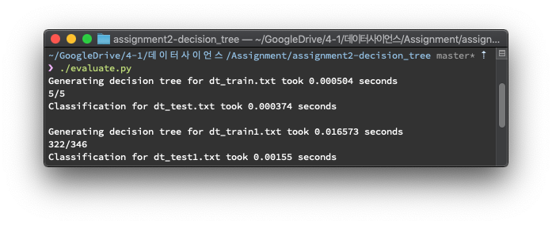
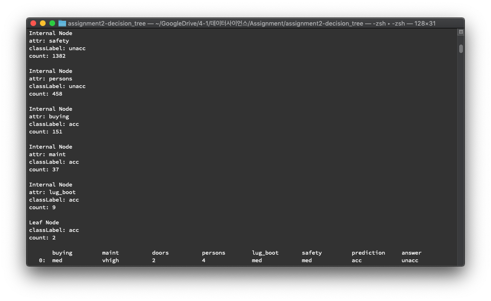
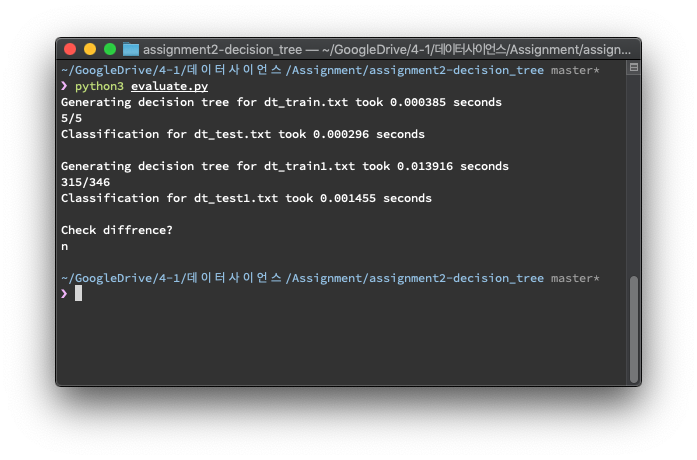
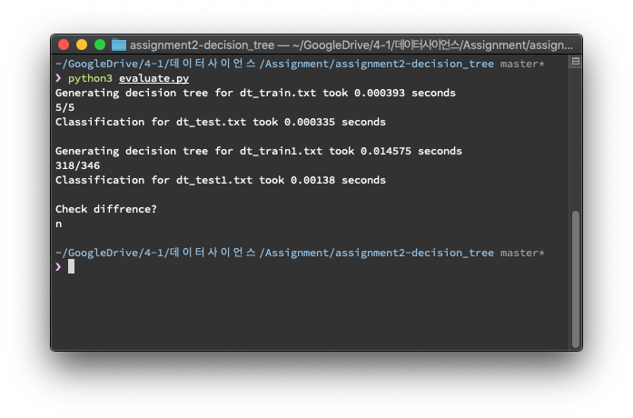
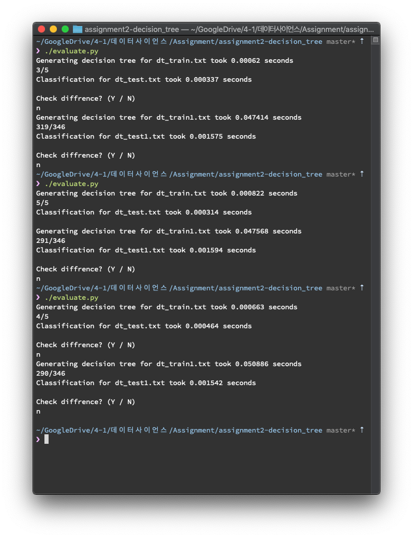

# Decision Tree Generator

[](https://github.com/lazyren)


## Quick Start

All programs are tested on macOS 10.14 & Ubuntu 18.04<br>

### Requirements

* Python3

### How to Run

#### dt.py

```bash
./dt.py [train file] [test file] [result file]
python3 dt.py [train file] [test file] [result file]
```

In order to execuate program using first command, you must have execution permission for `dt.py`.<br>If it gives permission error, either give it a execution permission or use second line command.<br>

#### evaluate.py

**evaluate.py** file will generate decision tree by importing functions from **dt.py** and evaluate it's accuracy.<br>

It also gives a user an option to check which tuple prediction went wrong.<br>If additional tests are required, append train, test, output, answer file lists within **evaluate.py**

```python
if __name__ == "__main__":
    trainFiles  = ["data/dt_train.txt",  "data/dt_train1.txt"  ]
    testFiles   = ["data/dt_test.txt",   "data/dt_test1.txt"   ]
    outputFiles = ["test/dt_result.txt", "test/dt_result1.txt" ]
    answerFiles = ["test/dt_answer.txt", "test/dt_answer1.txt" ]
```



Below is the example output of diffrence tracking.



## Implementation

### Node class

```python
class Node:
    def __init__(self, parent, attr, classLabel, cnt, isLeaf=False):
        self.parent = parent
        self.attr = attr
        self.children = dict()
        self.classLabel = classLabel
        self.cnt = cnt
        self.isLeaf = isLeaf

    def __repr__(self):
        if self.isLeaf:
            return "Leaf Node"
        else:
            return "Internal Node"

    def __str__(self):
        ret = repr(self) + "\n"
        if not self.isLeaf:
            ret += "attr: " + self.attr + "\n"
        ret += "classLabel: " + self.classLabel + "\n"
        ret += "count: " + str(self.cnt) + "\n"
        return ret
```

decision tree is generated with above `class Node`.<br>`attr` : Selected attribution for splitting. If current node is leaf, it will be empty string.<br>`children` : Dictionary of node's children. `Key` is attribute value.<br>`classLabel` : Result of prediction if classification ends at current node.<br>`cnt` : Number of tuples in data partition.


### generateTree()

This function is recursively called to construct decision tree.<br>Recursion ends at 3 conditions.

1. tuples are all of the same class.
2. attributes list is empty (MAJORITY VOTING)
3. data partition is empty.

**Algorithm**

let D = data partition; set of training tuples

1. If tuples in D are all of the same class OR attribute list is empty<br>	return *leaf node* with majority vote as *class label*
2. Use `attributeSelection()` method to find splitting attribute.
3. Split tuples in D based on split attribute value.<br>Either call `generateTree()` recursively or create leaf node(split ends up with 0 tuple)

Current version of `generateTree` uses improved version of gain ratio. Accuracy of each implementation will be shown at [Test Results](#test-results). `reducedErrorPruning()`  is implemented but not activated since pruning only makes accuracy worse.


## Test Results

#### Information Gain

It's the first implementation I used. choose attribute with highest information gain.

```python
# Calculate Entropy for given attribute.
def calcEntropy(classified):
	ret = 0.0
	for val in classified:
		p = val / sum(classified)
		ret -= p * log(p, 2)
	return ret

# Calculate information gain.
def calcGains(rows):
	infoGains = []
	DBsize = len(rows)
	totalEntropy = calcEntropy(Counter([row[-1] for row in rows]).values())
	for col in range(len(rows[0]) - 1):
		entropy = 0.0
		# {attrValue : {className : cnt}}
		classCounter = defaultdict(lambda: defaultdict(lambda: 0))
		for row in rows:
			classCounter[row[col]][row[-1]] += 1
		for classified in classCounter.values():
			entropy += sum(classified.values()) / DBsize * calcEntropy(classified.values())
		infoGains.append(totalEntropy - entropy)
	return infoGains


def attributeSelection(rows):
	infoGains = calcGains(rows)
	return infoGains.index(max(infoGains))
```



#### Gain Ratio

*Information gain* is biased toward attributes having a large number of values.<br>*Gain ratio* applies a kind of normalization to *information gain* using a "split information" to overcome bias.

```python
# Calculate Entropy for given attribute.
def calcEntropy(classified):
    info = 0.0
    for val in classified:
        p = val / sum(classified)
        info -= p * log(p, 2)
    return info


# Calculate split info for gain ratio.
def calcSplitInfo(classCounter, totalD):
    splitInfo = 0.0
    for classified in classCounter.values():
        partition = sum(classified.values()) / totalD
        splitInfo -= partition * log(partition, 2)
    return splitInfo


# Calculate gain ratio to be precise.
def calcGains(rows):
    infoGains = []
    totalD = len(rows)
    totalEntropy = calcEntropy(Counter([row[-1] for row in rows]).values())
    for col in range(len(rows[0]) - 1):
        entropy = 0.0
        # {attrValue : {className : cnt}}
        classCounter = defaultdict(lambda: defaultdict(lambda: 0))
        for row in rows:
            classCounter[row[col]][row[-1]] += 1
        for classified in classCounter.values():
            entropy += sum(classified.values()) / totalD * calcEntropy(classified.values())
        infoGains.append((totalEntropy - entropy) / calcSplitInfo(classCounter, totalD))
    return infoGains


# Calculate all gain ratio of attributes at the moment.
# Return index of most highest value.
def attributeSelection(rows):
    infoGains = calcGains(rows)
    return infoGains.index(max(infoGains))
```



#### Improved Gain Ratio

*Gain ratio* favors the creation of an unbalanced tree([Information Gain Versus Gain Ratio: A Study of Split Method Biases](<https://www.mitre.org/sites/default/files/pdf/harris_biases.pdf>)). So if one attribute's value has large portion in training sets, it is very likely to be chosen as class label during classification. In order to reduce this effect, I've made a modification on `getMajorityVoted()` to **select least popular attribute if their is a tie**.

```python
# If there is a tie, return attribute that has least amount.
def getMajorityVoted(classCounter, classHeader, attrValues):
    candidates = classCounter.most_common()
    vote = candidates[0][1]
    candidates = [x for x in candidates if x[1] == vote]
    voted = candidates[0][0]
    if len(candidates) == 1:
        return voted
    vote = attrValues[classHeader][voted]
    for candidate in candidates:
        if vote > attrValues[classHeader][candidate[0]]:
            vote = attrValues[classHeader][candidate[0]]
            voted = candidate[0]
    return voted
```


#### Reduced Error Pruning

Tree pruning method helps resolve *overfitting* issue.<br>

If you intend to use pruning, you must split test tuples in two. One for training, and one for pruning.<br>

* Using pruning method in evaluate.py<br>simply set `usePruning = True` in `runTest()` function.

```python
# Recursive function for the pruning.
def _pruning(tree, node, attributes, samples, prevCnt):
    if node.isLeaf:
        return False
    node.isLeaf = True
    cnt = getPredictionCnt(tree, attributes, samples)
    node.isLeaf = False
    isSubPruned = False
    for child in node.children.values():
        tmp = _pruning(tree, child, attributes, samples, max(prevCnt, cnt))
        if tmp:
            isSubPruned = True
    if not isSubPruned and cnt > prevCnt:
        node.isLeaf = True
        return True

    return False


# function name tells everything.
# Is not activated because pruning decreases the accuracy at the moment.
def reducedErrorPruning(tree, attrHeader, samples):
    _pruning(tree, tree, attrHeader, samples, getPredictionCnt(tree, attrHeader, samples))
```



Since pruning in **evaluate.py** shuffles training test set before splitting, it generates diffrent result everytime. As you can see from the result, the accuracy gets worse with pruning.<br>So even after implementation, it is not used in **dt.py** and **evaluate.py** by default.

