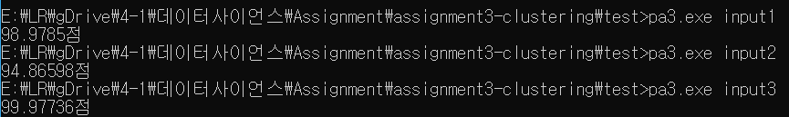

# DBSCAN

[](https://github.com/lazyren)


## Quick Start

All programs are tested on macOS 10.14 & Ubuntu 18.04<br>

### Requirements

* Python3

### How to Run

#### clustering.py

```bash
./clustering.py [input file] [number of clusters] [Eps] [MinPts]
python3 clustering.py [input file] [number of clusters] [Eps] [MinPts]
```

In order to execuate program using first command, you must have execution permission for `clustering.py`.<br>If it gives permission error, either give it a execution permission or use second line command.<br>


### Results

Note that output files will be located on the same folder as input file. (in data folder in example.)

**Result score may differ** from each excution because DBSCAN algorithm choose *random point* to generate *density-based clustering*.




## Implementation

### class Point

```python
class Point:
    def __init__(self, id, x, y):
        self.id = int(id)
        self.x = float(x)
        self.y = float(y)
        self.isVisited = False
        self.label = -1

    def __repr__(self):
        return self.__str__()

    def __str__(self):
        ret = "("
        ret += str(self.id) + ": "
        ret += str(self.x) + ", "
        ret += str(self.y) + ")"
        return ret
```

Each line from input file will be converted to a `Point` object.<br>

`id`: unique number that represents Point object.<br>`x`: x-coordinate in 2D<br>`y`: y-coordinate in 2D<br>`isVisited`: boolean value that is used while DBSCAN algorithm.<br>label: id of cluster that it belongs to.<br>

{isVisited, label} == {False, -1} --> not yet identified.<br>{isVisited, label} == {True, -1} --> outlier<br>Point may become {True, -1} after labelConverter is used to reduce # of clusters.


### loadData()

Simply read line to line from *input file* and generate `Point` object.<br>Return value is list of all `Point` objects that will be used to clustering.


### findNeighbor()

Find all neighbor Points from `cur` point. Neighbor must be positioned within radius of `eps`.<br>*Time Complexity* = O(n)


### dbscan()


pseudo code of DBSCAN[^1]<br>Implementation of DBSCAN algorithm. *Time Complexity* = O(n<sup>2</sup>)<br>

After creating *density-based clusters*, function also generates `labelconverter` dictionary.<br>Which is used to remove any extra clusters exceeding `N`(user given argument of max cluser #).<br>


### createOutputFile()

Generates `N` output files. Each file represents one *density-based cluster*.<br>`labelConverter` is used at this point to eliminate extra clusters(labels). Any *Point* with -1 as a label is either outlier or belongs to extra cluster.<br>Note that if number of created clusters is smaller than `N`, some output files are created as a blank file.

[^1]: Data Mining Concepts and Techniques Chapter 10.4