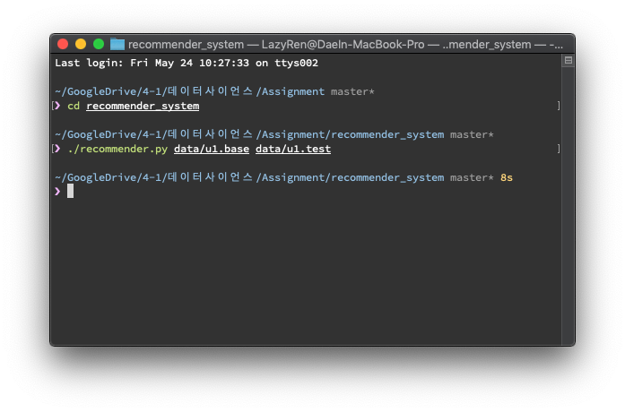
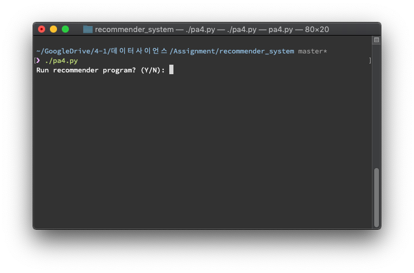
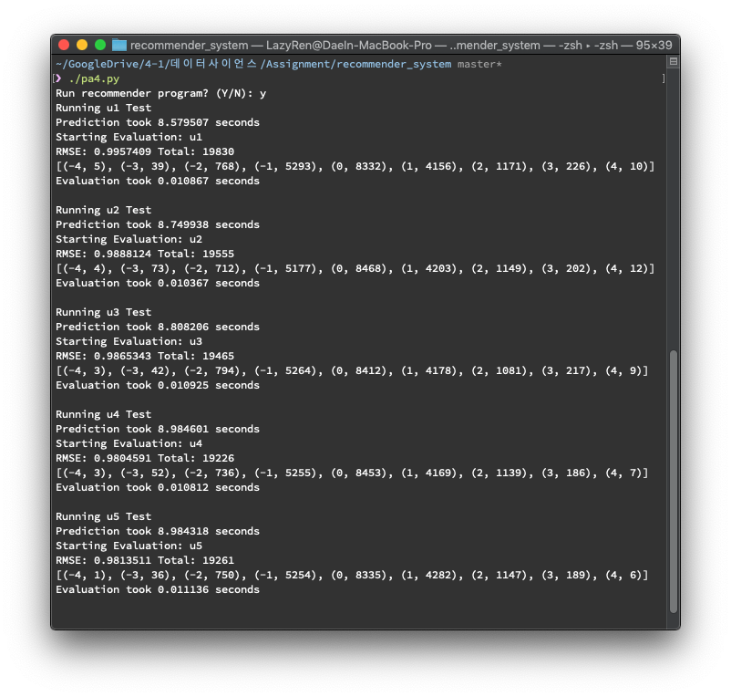
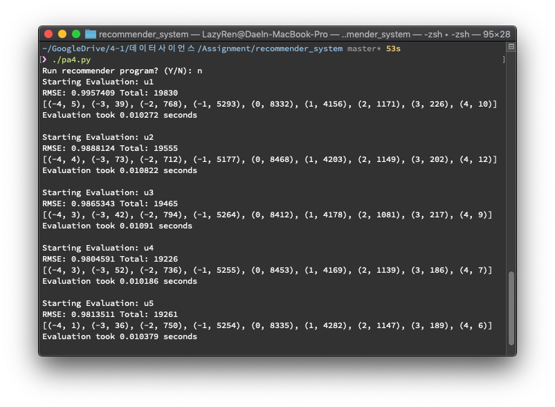
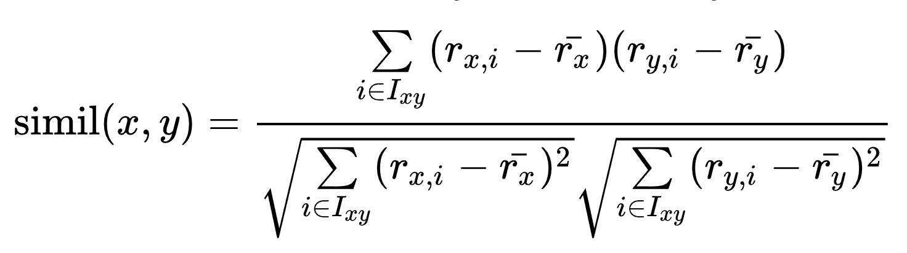
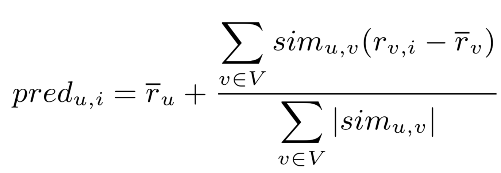

# Recommender System

[](https://github.com/lazyren)


## Quick Start

All programs are tested on macOS 10.14<br>

### Requirements

* Python3

### How to Run

#### recommender.py

```bash
./recommender.py [train file] [test file]
python3 recommender.py [train file] [test file]
```

In order to execuate program using first command, you must have execution permission for `recommender.py`.<br>If it gives permission error, either give it an execution permission or use second command.<br>



#### pa4.py

```bash
./pa4.py
python3 pa4.py
```

Running above command will ask you whether to run recommender program or not.



If you choose to run recommender program, `pa4.py` will automatically run `recommender.py` to train & test all u1 ~ u5.



Else, `pa4.py` will use existing u`N`.test & u`N`.base_prediction.txt files to evaluate **RMSE**.

You **MUST** have `base_prediction.txt` files ready to run in this way.



Detail of the execution, such as directory of data files, recommender program's name or which tests to run can be modified by changing below globar variables.

```python
inputFileDir  = "data/"
idealFileDir  = "data/"
outputFileDir = "data/"
EXECUTABLE_NAME = "recommender.py"
testNameList   = ["u1", "u2", "u3", "u4", "u5"]
```


## Implementation

### loadData()

Simply read line to line from *fileName* and generate list of *[(user_id), (item_id), (rating)]* <br>**Note** that *time_stamp* has been removed when parsed. Since prediction does not use that information in any way with current implementation.


### preprocessData()

Preprocess train data that has been loaded by `loadData()`.<br>For now, it only creates *ratingDict* for the future use.

```python
ratingDict[user][movie]  # rating of moive of user (user & movie must be int)
ratingDict[user]['mean'] # mean of user's all rating
```

*Time Complexity* = O(2r + u)<br># r = number of rows in data, u = number of users


### similarityMeasure()



Calcurate similarity using *Pearson Correlation Coefficient*.<br>Function only needs `ratingDict` created by `preprocessData()`.

*Time Complexity* = O(u<sup>2</sup> * m)<br># u = number of users, m = number of movies<br>Since m in time complexity refers to commonItem of two user, in most cases function will run in O(u^2).


### findNeighbors()

Calculate similarity of all user and sort them in descending order of similarity.<br>Return 2D list of tuple(uid, smilarity).

```python
# Returned 2D list
neighbors[uid][i] == (uid2, sim) # uid's ith closest neighbor who's id is uid2, with similarity of sim.
```

*Time Complexity* = O(u<sup>2</sup>)<br># u = number of users


### predictRating()



Predict rating of movie for user using KNN collaborative filtering.<br>Prediction use the mean of the neighbouring ratings weighted by their similarity[^1].<br>Algorithm stops in advance if similarity reaches negative for better prediction.

*Time Complexity* = O(u)<br># u = number of users

[^1]: Florent Garcin, Boi Faltings, Radu Jurca, Nadine Joswig, **Rating Aggregation in Collaborative Filtering Systems**

